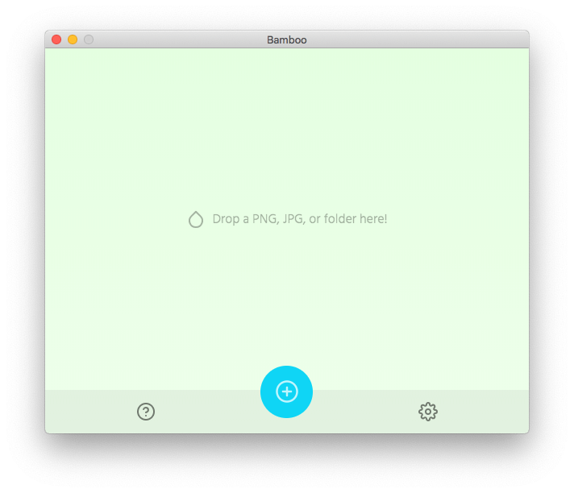

<p align="center">
  
</p>
<h1 align="center">Bamboo</h1>
<p align="center">A cross-platform TinyPNG client 🌱🎍</p>

Bamboo allows you to use your [TinyPNG](https://tinypng.com/) API key to losslessly compress local PNG/JPG's on your computer. It works by uploading your image to TinyPNG, then downloading the compressed output. In order to use this client, you'll need to get an [API key](https://tinypng.com/developers).

<p align="center">
  
</p>

# Download
Download the latest release [here](https://github.com/christopherwk210/bamboo/releases).

# Development
After forking/cloning:
```
$ npm install
$ npm start
```

To make a build:
```
$ npm run build.mac
or
$ npm run build.win
```

# License
MIT

Bamboo is not affiliated with nor endorsed by Tinify/TinyPNG/TinyJPG.
